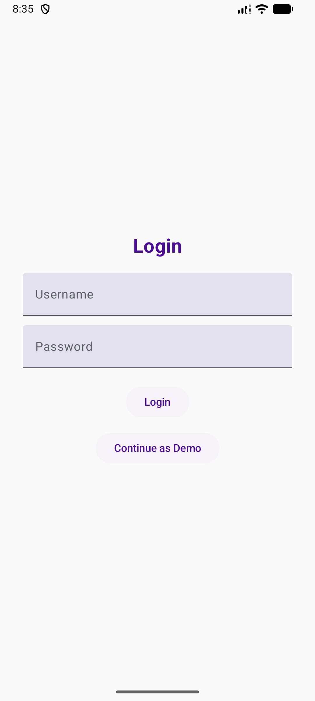
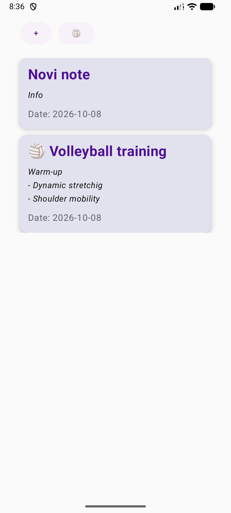
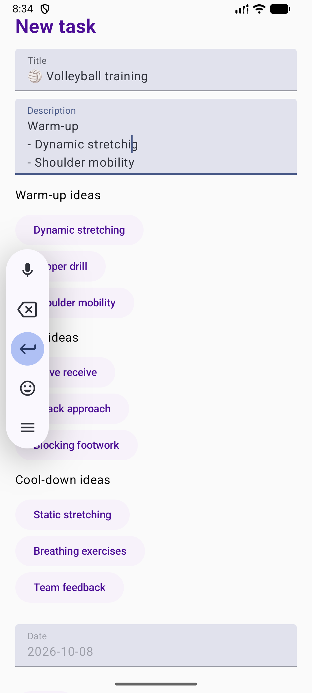

# VolleyTask

VolleyTask is a simple Android application for managing tasks and planning volleyball training sessions.

I developed this project during the FERIT Android Academy using Kotlin and Jetpack Compose. After completing the academy, I continued working on it by adding a demo mode, improving local data storage and organizing the code.

## Features

- Add, edit and delete tasks
- Create volleyball training plans
- Add suggested exercises for warm-up, drills and cool-down
- Save tasks locally using Room
- Use the app without an account through Demo Mode
- Keep tasks saved after closing the app

## Screenshots

| Login                           | Task List                               | Volleyball Training                       |
|---------------------------------|-----------------------------------------|-------------------------------------------|
|  |  |  |

## How to Run

1. Clone the repository.
2. Open the project in Android Studio.
3. Wait for Gradle to sync.
4. Run the app on an emulator or Android device.
5. Click **Continue as Demo** to try the application.

Demo Mode works without an internet connection and saves tasks locally.

The original project also includes API-based login and task management, but the external API is currently unavailable.

